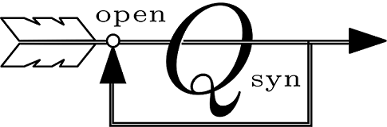

A modern open source toolbox for QFT control synthesis.

**Quantitative Feedback Theory (QFT)** is a frequency domain robust control
design technique, introduced by [Isaac Horowitz](https://en.wikipedia.org/wiki/Isaac_Horowitz). 
If you were looking for Quantum Field Theory you are in the wrong place!

**Open Qsyn** is a Matlab based, object oriented, free open 
source toolbox to aid QFT control synthesis. It replaces the obsolete
[Qsyn toolbox](https://www.math.kth.se/optsyst/forskning/forskarutbildning/5B5782/index.html)
developed by [Per-Olof Gutman](https://cee.technion.ac.il/members/per-olof-gutman/)
and co-workers in the 90s.
The development is supported by Prof. Gutman himself, and all 
reused code is done with his premission. 

**Open Qsyn** is distributed under GNU LGPLv3 license without any warranty.

## How to use

### Installation
1. [Download](https://github.com/qsyn/openQsyn/archive/master.zip) and unzip the
   recent version (or fork the [repo](https://github.com/qsyn/openQsyn.git))
   into a new folder named `<folderName>`   
3. Add  `<folderName>` to your Matlab path
4. Run `oqsyn_ini` to initiate the toolbox

### Demo 
A quick introductory example is provided by the live script `exmaple.mlx`.
This exmaple will guide you through the steps of SISO design: definning a 
new plant and design specifications, computaing templates and bounds, 
designing a feedback compensator and a pre-filter. 

### Documentation
Open Qsyn uses Matlab based documentation, thus viewd using standard Matlab 
`help` and `doc` commands.

- General documentation is accsessed by typing `help <folderName>`, with 
  `<folderName>` Open Qsyn installation folder. 
- Documentation for a functions is viewd by typing `help <functionName>`.
- Documentation for a class is viewed by typing `help <className>`.
- Documentation for a method is viewed by typing `help <className/methodName>`. 

## Status
Open Qsyn toolbox is under construction, 
but it can already be used for SISO QFT design for plants with parametric 
uncertainty, unstructuerd uncertainty, and uncertain delay. 
Feel free to open issues in order to report bugs or suggests new features. 
Just check the GitHub [issues section](https://github.com/qsyn/openQsyn/issues)
first :). 

The toolbox is regulary tested on Matlab 2015b,2017a,2017b. 
For complete functionality the Control Systems Toolbox is required. 

## Contact
rubindan115 at gmail dot com
